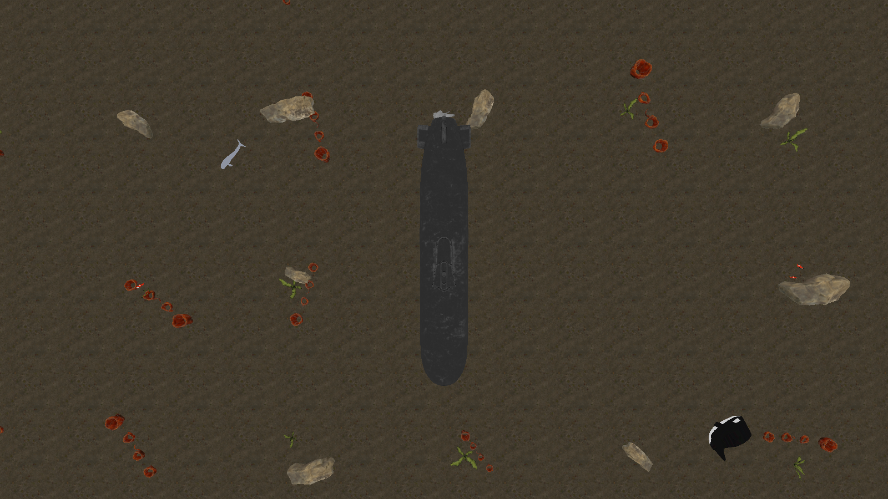
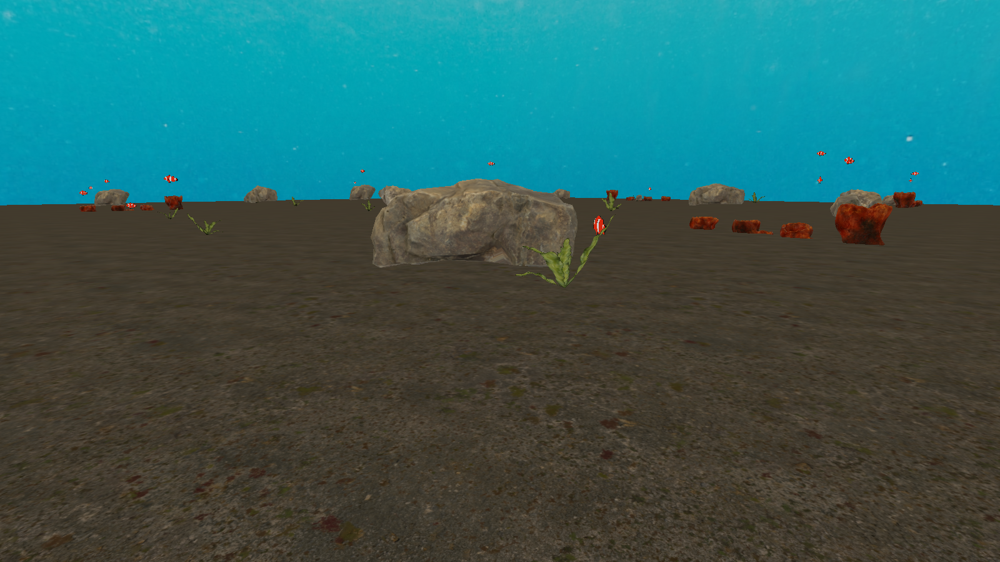
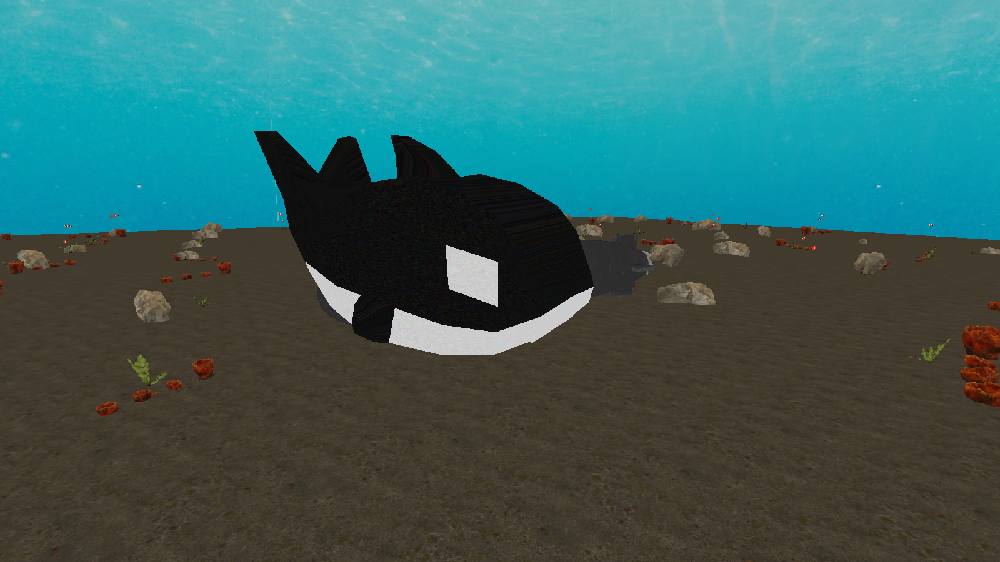
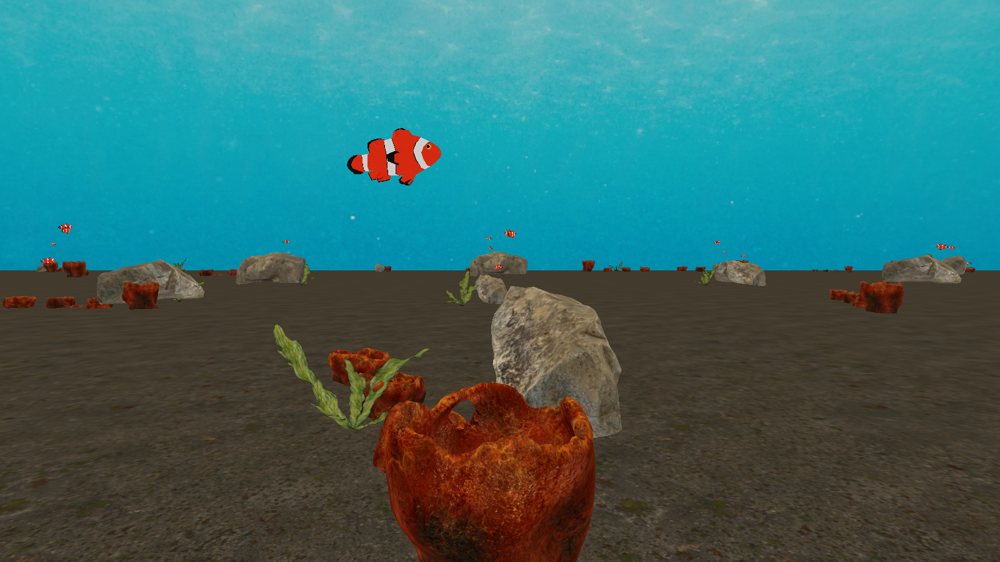
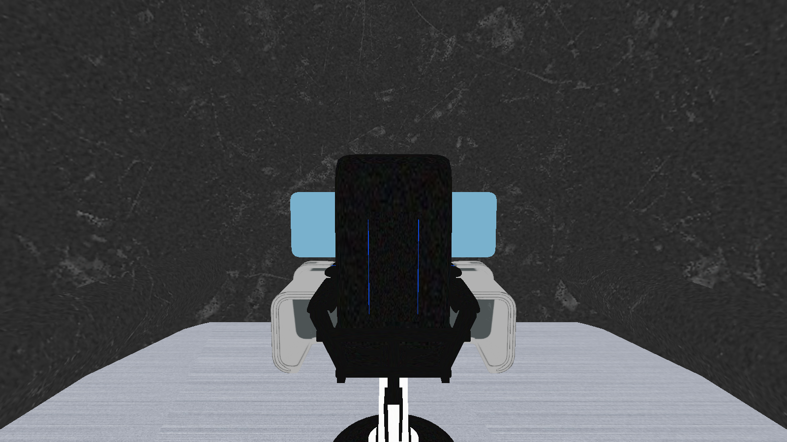
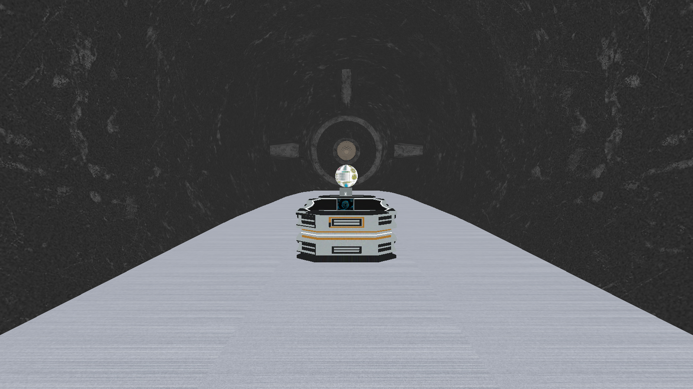
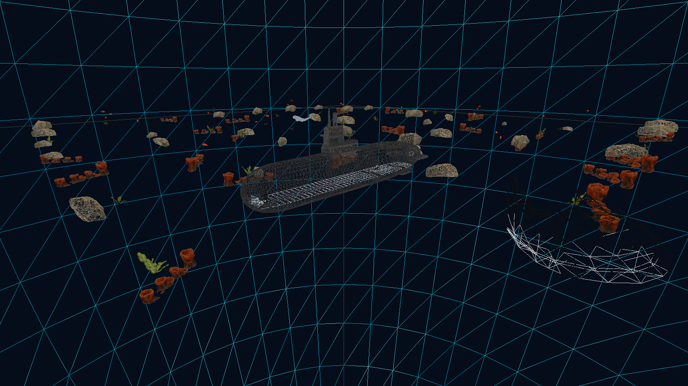

# Projeto 2: Cenário Submarino 3D

**SCC0250, Computação Gráfica · 2026.1 · ICMC-USP**

Feito por:
**Enzo Tonon Morente - 14568476**
**Cauê Paiva Lira - 14675416**


---

## 1. Visão geral

Cenário 3D interativo em **OpenGL 3.3 core profile** que coloca o
usuário, em câmera de primeira pessoa, dentro e ao redor de um
submarino apoiado em um leito de areia. O cenário é dividido em duas
zonas:

- **Exterior**: submarino completo, leito de areia que se estende
  até o horizonte, *skydome* panorâmico oceânico, decoração
  procedural (corais, pedras e algas) cobrindo toda a área visível,
  cardume de peixes-palhaço em alturas variadas, uma orca e uma
  beluga gigante.
- **Interior**: corredor metálico que segue a curva real do casco
  ao longo de todo o comprimento da popa à proa, com cadeira
  *sci-fi* do piloto, estação de monitoramento com tela
  holográfica, joystick UAV em pé e console *sci-fi* de comando na
  popa.

Pontos centrais da implementação:

| | |
|---|---|
| Engine | OpenGL 3.3 core, **sem nenhuma chamada de pipeline fixo** (sem `glRotate`/`glTranslate`/`glScale`/`glBegin/End`/`glPushMatrix`) |
| Matrizes | Tudo montado à mão em `numpy` e enviado como `mat4` uniform aos shaders |
| Iluminação | Pipeline *unlit*: cor por pixel = amostra de textura difusa |
| Modelos `.obj` | **11** modelos importados, todos texturizados, vários com múltiplos materiais (multi-textura) |
| Transformações interativas | **Escala** (orca), **rotação** (beluga) e **translação** (cadeira), uma em cada modelo, todas controladas pelo teclado |
| Linhas de código | ~2 420 linhas de Python no runtime, ~63 linhas de GLSL, ~1 300 linhas no pipeline de assets |

---

## 2. Como executar

```bash
cd projeto2_submarino
python -m venv .venv
source .venv/bin/activate              # Windows: .venv\Scripts\activate
pip install -r requirements.txt
python src/main.py
```

Testado em **macOS 25.3** (Apple Silicon) e **Ubuntu 22.04** com
Python **3.12**. Os assets já vêm pré-construídos em
`assets/modelos/` e `assets/skybox/`, então não é necessário rodar o
pipeline de build para executar.

---

## 3. Controles

| Tecla | Ação |
|---|---|
| `W` `A` `S` `D` | Movimento horizontal (FPS, projetado no plano XZ) |
| `Espaço` / `Shift` | Subir / descer (movimento vertical absoluto) |
| Mouse | Olhar em volta (yaw + pitch, com clamp para evitar *gimbal lock*) |
| `]` / `[` | **Escala** da **orca**: aumentar / diminuir uniformemente (clamp de 0.3× a 3.0×) |
| `R` / `Q` | **Rotação** da **beluga** em torno do eixo vertical (sentido horário / anti-horário, passo de 30°, com auto-repeat) |
| `T` / `G` | **Translação** da **cadeira** ao longo de Z (frente / trás, passo de 0.20 m, clamp ±1 m) |
| `F` / `H` | **Translação** da **cadeira** ao longo de X (lado a lado, passo de 0.20 m, clamp ±1 m) |
| `P` | Alternar modo *wireframe* |
| `Esc` | Sair |

As três transformações exigidas pelo edital (escala, rotação e
translação) estão aplicadas em **modelos diferentes** (orca, beluga
e cadeira respectivamente) e cada uma é acionada por **teclas
independentes**, exatamente como pede o requisito 7.

---

## 4. Cenário externo

### 4.1 Vista panorâmica

O submarino fica no centro da cena. A decoração é **procedural**:
um *grid* 40×40 com *jitter* aleatório posiciona corais, pedras e
algas pelo leito todo, com uma *exclusion box* em volta do casco
para nada nascer dentro/sob ele. As contagens fixas por categoria
(72 corais + 90 pedras + 88 algas + 92 peixes-palhaço) são
determinadas por uma RNG semeada, então cada execução produz
**a mesma cena**, garantindo reprodutibilidade.


### 4.2 Vista superior (densidade da decoração)



### 4.3 Silhueta lateral do submarino + skydome

O céu é um *skydome* esférico panorâmico (textura
equirretangular) ancorado à câmera, ou seja, ele acompanha o
jogador, dando a impressão de um oceano infinito.


### 4.4 Decoração procedural em close

Pedras com texturização realista, corais com geometria volumosa e
algas com folhagem semi-transparente. Os peixes-palhaço passam ao
fundo.



---

## 5. Animais interativos

### 5.1 Orca: escala via teclado (`]` / `[`)

A orca aceita ampliação e redução discreta da sua escala uniforme,
com *clamp* em 0.3× a 3.0×. A transformação é aplicada como uma
matriz `S` extra antes da `R`·`T`, sem afetar nenhum outro objeto
da cena.



### 5.2 Beluga: rotação via teclado (`R` / `Q`)

A beluga aceita rotação em torno do eixo vertical em qualquer
sentido. Ambas as teclas têm *auto-repeat* enquanto seguradas
(rate-limited a ~6 passos/seg para uma sensação contínua sem
"pular" o ângulo). Internamente o yaw é acumulado em radianos e
montado como uma `R_y`(θ) padrão.


### 5.3 Cardume de peixes-palhaço

92 peixes posicionados em um *grid* procedural, com altura
aleatória variando entre 1.5 m e 9 m sobre o leito. Cada um tem 5
materiais distintos (*body*, *fins*, *eye*, *teeth*, *stripes*) que
demonstram o suporte multi-textura do *loader*.



---

## 6. Cenário interno (cabine do piloto)

### 6.1 POV do piloto: joystick + estação

Câmera dentro do casco, atrás da cadeira, olhando para a proa. O
piso metálico, o joystick UAV em primeiro plano e a tela
holográfica azulada da estação de monitoramento são todos modelos
`.obj` separados, posicionados manualmente segundo seus *AABBs*
para alinhamento perfeito.



### 6.2 Cadeira do piloto: translação via teclado (`T` / `G` / `F` / `H`)

A cadeira tem **13 sub-malhas** (estofamento, frame metálico, base,
telas, parafusos, etc.), todas lidas do `.mtl` original e
renderizadas com texturas independentes. Ela é o objeto que cumpre
o requisito de **translação interativa** do edital: as teclas
`T`/`G` deslocam a cadeira no eixo Z (frente/trás) e `F`/`H` no eixo
X (lado a lado), em passos de 0.20 m, com *clamp* em ±1 m em torno
da posição base, o suficiente para o piloto ajustar o assento
sem ele atravessar o casco.

Implementação em `Scene.translate_chair_step(dx, dz)`: a posição
base é guardada em `chair_base_translation` e o deslocamento
acumulado fica em `SceneState.chair_translate_x/z`; a cada chamada
recalculamos `chair_obj.translation = base + acumulado`, o que vira
uma matriz `T` no shader sem afetar nenhum outro objeto.


### 6.3 Console *sci-fi* na popa

O console (`mesa.obj`) é o modelo mais complexo do projeto: **10
materiais distintos** (computador, tela, *main mat A/B*, *yellow
mat*, *blue glow*, *black reflection*, *globe*, etc.). É uma
demonstração explícita do requisito de "múltiplas texturas por
modelo".



---

## 7. Modo wireframe (`P`)

Tecla única para alternar `glPolygonMode(GL_FRONT_AND_BACK, GL_LINE)`.
Mostra que toda a geometria do projeto, incluindo o *skydome*, é
formada por triângulos reais (sem nenhum *billboard* ou *imposter*
disfarçado).



---

## 8. Atendimento ao edital

A tabela abaixo lista os **12 requisitos** do edital e onde cada um
é atendido no projeto.

| # | Requisito | Onde está atendido | Evidência |
|---|---|---|---|
| 1 | Cenário com **ambiente interno + externo** e objetivo coerente | Submarino delimita os dois ambientes: exterior é o leito oceânico ao redor; interior é a cabine pressurizada do piloto | §4 (externo) e §6 (interno) |
| 2 | **≥ 6 modelos** `.obj` 3D com textura, sem repetir os de aula | **11 modelos** em `assets/modelos/`: submarino, coral, pedra, alga, cadeira, estação, mesa, joystick_2, peixe-palhaço, orca, beluga (todos baixados de free3d / CGTrader / BlendSwap) | seções 4 a 6 |
| 3 | **≥ 3 modelos no interno + ≥ 3 modelos no externo** (sem contar o delimitador) | **Internos (4):** cadeira, estação, mesa, joystick_2. **Externos (6):** coral, pedra, alga, peixe-palhaço, orca, beluga. O submarino é o delimitador e não é contado | §4, §6 |
| 4 | Cada modelo de um **`.obj` próprio** (sem cenas pré-montadas) | Cada um dos 11 modelos vem de seu próprio arquivo `.obj` em `assets/modelos/<nome>/<nome>.obj`; o pipeline de build (`tools/build_assets.py`) garante que múltiplos objetos em um único `.obj` fonte sejam segmentados | (todos os modelos) |
| 5 | Modelos **escalados de forma coerente** com o mundo real | Cada objeto é escalado a partir do seu *AABB* nativo para uma medida em metros plausível: submarino ≈ 47 m × 9 m × 17 m, cadeira ≈ 1.6 m de altura, beluga ≈ 5 m, peixes-palhaço ≈ 0.2 m | §4 a §6 |
| 6 | **Pisos diferentes** no interno e no externo | Externo: chão de areia 4K (`coast_sand_05_diff_4k.jpg`, 400 m × 400 m, *tiled* 40×). Interno: piso de **metal escovado** (`metal_brushed.jpg`) que segue a curvatura real do casco do submarino da popa à proa (`make_hull_following_floor` em `scene.py`) | §6.1 e §6.3 (piso metálico claro debaixo dos modelos) |
| 7 | **Escala, rotação e translação** aplicadas a **modelos diferentes**, cada uma com tecla independente | **Escala** na orca (`]` / `[`) · **Rotação** na beluga (`R` / `Q`) · **Translação** na cadeira (`T`/`G`/`F`/`H`) | §5.1, §5.2, §6.2 |
| 8 | **Skybox** com textura | *Skydome* esférico de raio 250 m com textura panorâmica equirretangular oceânica, ancorado à câmera (`make_sky_sphere` + `shaders/skydome.{vert,frag}`) | §4.3 |
| 9 | **Restringir a exploração** à borda do céu / terreno | `Camera.clamp()` aplica `bounds_xz = (-100, 100)` e `bounds_y = (0.4, 60)` a cada frame, mantendo a câmera bem dentro do raio do *skydome* (250 m) e acima do chão (Y = 0) | `src/camera.py` linhas 133-142 |
| 10 | **Wireframe** alternável com `P` | `_on_key` em `src/main.py` alterna `glPolygonMode(GL_FRONT_AND_BACK, GL_LINE / GL_FILL)` ao detectar `KEY_P` | §7 |
| 11 | Modelos importados de **arquivos Wavefront `.obj`** | Loader manual em `src/model.py` (parser de `v / vt / vn / f / usemtl / mtllib`); pipeline em `tools/build_assets.py` converte `.fbx` / `.blend` originais para `.obj` quando preciso | (todos os modelos) |
| 12 | **Sem iluminação dinâmica** | `shaders/basic.frag` é `FragColor = texture(uDiffuse, vUV)` puro, sem `normal`, sem `lightDir`, sem cálculo de Phong/Blinn | (cor chapada visível em todas as imagens) |

A presença de **multi-material por modelo** também é demonstrada
explicitamente em `cadeira.obj` (13 sub-malhas), `joystick_2.obj`
(11), `mesa.obj` (10), `peixe_palhaco.obj` (5) e `estacao.obj` (2).
O loader em `src/model.py` parseia `usemtl` e emite uma
`glDrawElements` por material.

---

## 9. Estrutura técnica resumida

```
projeto2_submarino/
├── src/                  ← runtime (~2 420 linhas de Python)
│   ├── main.py             janela GLFW + input + loop principal
│   ├── camera.py           câmera FPS (yaw/pitch + clamp + bounds)
│   ├── utils.py            matrizes 4×4 (translate/rotate/scale/perspective/look_at)
│   ├── model.py            loader de .obj multi-material + draw_model
│   ├── shader.py           wrapper compile/link + cache de uniforms
│   ├── texture.py          PIL → glTexImage2D
│   └── scene.py            montagem da cena, decoração procedural, animação
│
├── shaders/              ← GLSL 330 core (~63 linhas)
│   ├── basic.{vert,frag}   pipeline padrão (textura difusa)
│   └── skydome.{vert,frag} skybox panorâmico
│
├── assets/
│   ├── modelos/            11 .obj + .mtl + texturas associadas
│   └── skybox/             panorama oceânico equirretangular
│
└── tools/                ← offline (~1 300 linhas de Python)
    └── build_assets.py     pipeline de conversão .fbx/.blend/.obj brutos → assets/
```

### Fluxo de um frame

1. `main.py` lê input do GLFW e atualiza estado da `Camera`.
2. `Scene.draw(view, proj)` percorre a lista de `Object3D`,
   monta a matriz `M = T · R · S` para cada um, envia
   `model/view/proj` como uniforms para o shader e chama
   `draw_model`, que faz um `glDrawElements` por sub-malha
   (uma por material).
3. O *skydome* é desenhado primeiro com `depthMask = false` para
   ficar atrás de tudo.

### Como o pipeline lida com modelos sem textura

Modelos cuja fonte trazia apenas cores difusas (sem mapa) são
processados pelo `build_assets.py`, que **gera proceduralmente**
um PNG sólido de 16×16 px para cada material e reescreve o `.mtl`
para apontar para esse PNG. Assim, **todos os 11 modelos são
texturizados** no runtime, atendendo à exigência mesmo quando o
download original era cor-pura.

---

## 10. Observações finais

- O projeto usa **Python 3.12 especificamente** porque o
  `assimp_py` (responsável por ler `.fbx` / `.blend` no pipeline
  de build offline) ainda não tem *wheel* para 3.13+. O runtime em
  si só depende de **PyOpenGL**, **GLFW**, **numpy** e **Pillow**,
  todos compatíveis com versões mais novas.
- Todos os arquivos `.py` do diretório `src/` estão extensivamente
  comentados em PT-BR, explicando linha a linha o que cada bloco
  faz e por quê (especial atenção a `scene.py`, que documenta os
  *AABBs* e os offsets de cada modelo).
