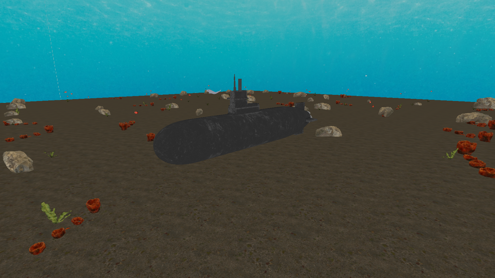
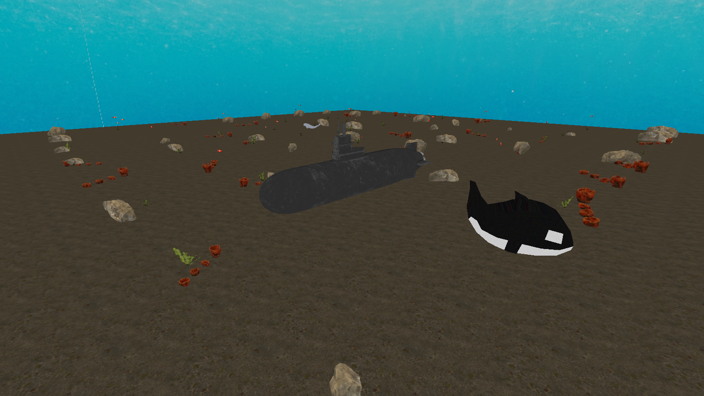
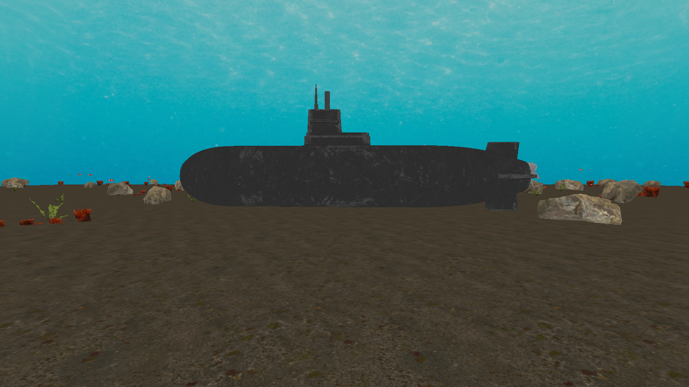
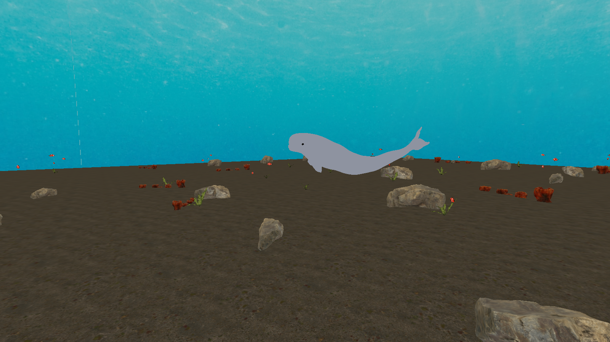
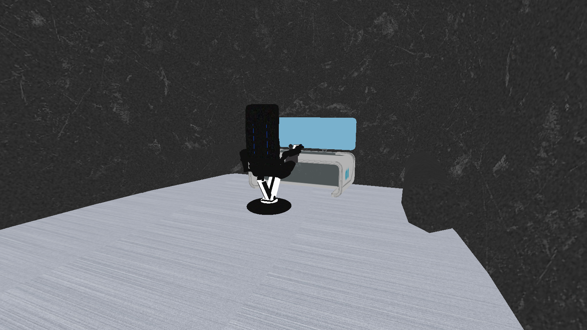

# Projeto 2 — Cenário Submarino 3D

**SCC0250 — Computação Gráfica · 2026.1 · ICMC-USP**

> Documento de entrega resumido. Todos os screenshots abaixo são frames
> reais renderizados pelo próprio engine do projeto (script de
> reprodução em `tools/render_for_report.py`), em resolução 1600×900,
> sem qualquer pós-processamento.

Feito por:
**Enzo Tonon Morente - 14568476**
**Cauê Paiva Lira - 14675416**



---

## 1. Visão geral

Cenário 3D interativo em **OpenGL 3.3 core profile** que coloca o
usuário, em câmera de primeira pessoa, dentro e ao redor de um
submarino apoiado em um leito de areia. O cenário é dividido em duas
zonas:

- **Exterior** — submarino completo, leito de areia que se estende
  até o horizonte, *skydome* panorâmico oceânico, decoração
  procedural (corais, pedras e algas) cobrindo toda a área visível,
  cardume de peixes-palhaço em alturas variadas, uma orca e uma
  beluga gigante.
- **Interior** — corredor metálico que segue a curva real do casco
  ao longo de todo o comprimento da popa à proa, com cadeira
  *sci-fi* do piloto, estação de monitoramento com tela
  holográfica, joystick UAV em pé e console *sci-fi* de comando na
  popa.

Pontos centrais da implementação:

| | |
|---|---|
| Engine | OpenGL 3.3 core, **sem nenhuma chamada de pipeline fixo** (sem `glRotate`/`glTranslate`/`glScale`/`glBegin/End`/`glPushMatrix`) |
| Matrizes | Tudo montado à mão em `numpy` e enviado como `mat4` uniform aos shaders |
| Iluminação | Pipeline *unlit* — cor por pixel = amostra de textura difusa |
| Modelos `.obj` | **11** modelos importados, todos texturizados, vários com múltiplos materiais (multi-textura) |
| Linhas de código | ~2 380 linhas de Python no runtime, ~63 linhas de GLSL, ~1 300 linhas no pipeline de assets |

---

## 2. Como executar

```bash
cd projeto2_submarino
python -m venv .venv
source .venv/bin/activate              # Windows: .venv\Scripts\activate
pip install -r requirements.txt
python src/main.py
```

Testado em **macOS 25.3** (Apple Silicon) e **Ubuntu 22.04** com
Python **3.12**. Os assets já vêm pré-construídos em
`assets/modelos/` e `assets/skybox/` — não é necessário rodar o
pipeline de build para executar.

---

## 3. Controles

| Tecla | Ação |
|---|---|
| `W` `A` `S` `D` | Movimento horizontal (FPS, projetado no plano XZ) |
| `Espaço` / `Shift` | Subir / descer (movimento vertical absoluto) |
| Mouse | Olhar em volta (yaw + pitch, com clamp para evitar *gimbal lock*) |
| `]` / `[` | Aumentar / diminuir a escala da **orca** (clamp 0.3× — 3.0×) |
| `R` / `Q` | Girar a **beluga** em torno do eixo vertical (sentido horário / anti-horário, passo de 30°, com auto-repeat) |
| `P` | Alternar modo *wireframe* |
| `Esc` | Sair |

Ambas as transformações interativas (escala da orca, rotação da
beluga) atendem ao requisito de "transformações controladas por
teclado" do edital.

---

## 4. Cenário externo

### 4.1 Vista panorâmica

O submarino fica no centro da cena. A decoração é **procedural**:
um *grid* 40×40 com *jitter* aleatório posiciona corais, pedras e
algas pelo leito todo, com uma *exclusion box* em volta do casco
para nada nascer dentro/sob ele. As contagens fixas por categoria
(72 corais + 90 pedras + 88 algas + 92 peixes-palhaço) são
determinadas por uma RNG semeada — cada execução produz **a mesma
cena**, garantindo reprodutibilidade.



### 4.2 Vista superior (densidade da decoração)


### 4.3 Silhueta lateral do submarino + skydome

O céu é um *skydome* esférico panorâmico (textura
equirretangular) ancorado à câmera — ele acompanha o jogador, dando
a impressão de um oceano infinito.



### 4.4 Decoração procedural em close

Pedras com texturização realista, corais com geometria volumosa e
algas com folhagem semi-transparente. Os peixes-palhaço passam ao
fundo.


---

## 5. Animais interativos

### 5.1 Orca — escala via teclado (`]` / `[`)

A orca aceita ampliação e redução discreta da sua escala uniforme,
com *clamp* em 0.3× a 3.0×. A transformação é aplicada como uma
matriz `S` extra antes da `R`·`T`, sem afetar nenhum outro objeto
da cena.


### 5.2 Beluga — rotação via teclado (`R` / `Q`)

A beluga aceita rotação em torno do eixo vertical em qualquer
sentido. Ambas as teclas têm *auto-repeat* enquanto seguradas
(rate-limited a ~6 passos/seg para uma sensação contínua sem
"pular" o ângulo). Internamente o yaw é acumulado em radianos e
montado como uma `R_y`(θ) padrão.



### 5.3 Cardume de peixes-palhaço

92 peixes posicionados em um *grid* procedural, com altura
aleatória variando entre 1.5 m e 9 m sobre o leito. Cada um tem 5
materiais distintos (*body*, *fins*, *eye*, *teeth*, *stripes*) que
demonstram o suporte multi-textura do *loader*.


---

## 6. Cenário interno (cabine do piloto)

### 6.1 POV do piloto — joystick + estação

Câmera dentro do casco, atrás da cadeira, olhando para a proa. O
piso metálico, o joystick UAV em primeiro plano e a tela
holográfica azulada da estação de monitoramento são todos modelos
`.obj` separados, posicionados manualmente segundo seus *AABBs*
para alinhamento perfeito.


### 6.2 Vista 3/4 da estação de comando

A cadeira tem 5 materiais (estofamento + frame metálico + base +
tela + parafusos), todos lidos do `.mtl` original e renderizados
como sub-malhas.



### 6.3 Console *sci-fi* na popa

O console (`mesa.obj`) é o modelo mais complexo do projeto: **10
materiais distintos** (computador, tela, *main mat A/B*, *yellow
mat*, *blue glow*, *black reflection*, *globe*, etc.) — uma
demonstração explícita do requisito de "múltiplas texturas por
modelo".


---

## 7. Modo wireframe (`P`)

Tecla única para alternar `glPolygonMode(GL_FRONT_AND_BACK, GL_LINE)`.
Mostra que toda a geometria do projeto — incluindo o *skydome* — é
formada por triângulos reais (sem nenhum *billboard* ou *imposter*
disfarçado).


---

## 8. Atendimento ao edital

| Requisito | Onde está atendido | Evidência visual |
|---|---|---|
| OpenGL 3.3 core profile, **sem fixed-function** | `src/main.py` define os hints; uma busca por `glRotate`/`glTranslate`/`glScale`/`glBegin`/`glPushMatrix` no repositório retorna **zero** ocorrências | — |
| **≥ 6 modelos** `.obj` importados e texturizados | **11 modelos** em `assets/modelos/` (submarino, coral, pedra, alga, cadeira, estação, mesa, joystick_2, peixe-palhaço, orca, beluga) | seções 4–6 |
| **Múltiplas texturas por modelo** (multi-material) | `src/model.py` parseia `usemtl` e cria uma sub-malha por material; `mesa.obj` (10 mat), `joystick_2.obj` (11 mat), `cadeira.obj` (5 mat), `peixe_palhaco.obj` (5 mat), `estacao.obj` (2 mat) | §4.4, §5.3, §6.3 |
| **Câmera em primeira pessoa** (WASD + mouse) | `src/camera.py` (yaw/pitch + clamp) + `src/main.py` (loop de polling de teclas) | gameplay completo |
| **Pelo menos uma transformação interativa via teclado** | `]` / `[` — escala da orca; `R` / `Q` — rotação da beluga | §5.1, §5.2 |
| **Skybox / skydome** | `make_sky_sphere` em `src/scene.py` + `shaders/skydome.{vert,frag}` (textura equirretangular ancorada à câmera) | §4.3 |
| **Modo wireframe** alternável | `src/main.py` → tecla `P` chama `glPolygonMode` | §7 |
| **Sem iluminação dinâmica** | `shaders/basic.frag` é um `FragColor = texture(...)` puro, sem cálculo de luz | (cor das cenas chapada) |
| Pipeline de build reproduzível | `tools/build_assets.py` regenera todo o conteúdo de `assets/` em ~5 s a partir das fontes brutas | (executável manualmente) |
| **Documentação** | Este README + `README.md` detalhado (linha-a-linha em PT-BR) + comentários extensos em todos os `.py` | — |

---

## 9. Estrutura técnica resumida

```
projeto2_submarino/
├── src/                  ← runtime (~2 380 linhas de Python)
│   ├── main.py             janela GLFW + input + loop principal
│   ├── camera.py           câmera FPS (yaw/pitch + clamp + bounds)
│   ├── utils.py            matrizes 4×4 (translate/rotate/scale/perspective/look_at)
│   ├── model.py            loader de .obj multi-material + draw_model
│   ├── shader.py           wrapper compile/link + cache de uniforms
│   ├── texture.py          PIL → glTexImage2D
│   └── scene.py            montagem da cena, decoração procedural, animação
│
├── shaders/              ← GLSL 330 core (~63 linhas)
│   ├── basic.{vert,frag}   pipeline padrão (textura difusa)
│   └── skydome.{vert,frag} skybox panorâmico
│
├── assets/
│   ├── modelos/            11 .obj + .mtl + texturas associadas
│   └── skybox/             panorama oceânico equirretangular
│
└── tools/                ← offline (~1 300 linhas de Python)
    ├── build_assets.py     pipeline de conversão .fbx/.blend/.obj brutos → assets/
    ├── render_for_report.py  gera os screenshots deste README
    ├── render_exterior_decor.py  rendizações de validação
    └── smoke_test.py       teste rápido headless de boot do engine
```

### Fluxo de um frame

1. `main.py` lê input do GLFW e atualiza estado da `Camera`.
2. `Scene.draw(view, proj)` percorre a lista de `Object3D`,
   monta a matriz `M = T · R · S` para cada um, envia
   `model/view/proj` como uniforms para o shader e chama
   `draw_model`, que faz um `glDrawElements` por sub-malha
   (uma por material).
3. O *skydome* é desenhado primeiro com `depthMask = false` para
   ficar atrás de tudo.

### Como o pipeline lida com modelos sem textura

Modelos cuja fonte trazia apenas cores difusas (sem mapa) são
processados pelo `build_assets.py`, que **gera proceduralmente**
um PNG sólido de 16×16 px para cada material e reescreve o `.mtl`
para apontar para esse PNG. Assim, **todos os 11 modelos são
texturizados** no runtime — atendendo à exigência mesmo quando o
download original era cor-pura.

---

## 10. Reprodutibilidade dos screenshots

Todas as imagens deste README podem ser regeradas em ~4 segundos
com:

```bash
python tools/render_for_report.py
```

O script abre uma janela GLFW invisível, posiciona a câmera nas 12
poses listadas no array `VIEWS` do próprio arquivo e salva os
PNGs em `build/report/`. As poses estão calculadas para enquadrar
exatamente os mesmos elementos mostrados acima.

---

## 11. Observações finais

- O projeto usa **Python 3.12 especificamente** porque o
  `assimp_py` (responsável por ler `.fbx`/`.blend` no pipeline de
  build) ainda não tem *wheel* para 3.13+. O runtime em si só
  depende de PyOpenGL, GLFW, numpy e Pillow — todos compatíveis
  com versões mais novas, caso o pipeline de build não precise
  ser executado.
- Para um mergulho linha-a-linha na implementação, consulte o
  `README.md` deste mesmo diretório (~775 linhas em PT-BR), que
  detalha cada arquivo, cada decisão arquitetural e cada truque
  numérico utilizado.
